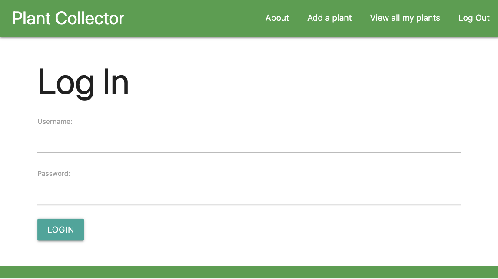

# Plant Collector 🌿

[Plant Collector](https://plant-collections.herokuapp.com/) is a Django app meant to provide a space for users to add their plants, plant information, plant photos and track care for their plants.

## Usage 👩‍💻

In order to get started, clone this repo. Change your directory to where you want to host the app and enter the commands below in your terminal:

```bash
git clone https://github.com/mikezalik/plantcollector.git
cd plantcollector
pip3 install -r requirements.txt
```

In order to setup a local environment you'll need to change this field in plantcollector/settings.py

```
DATABASES = {
    'default': {
        'ENGINE': 'django.db.backends.postgresql',
        'NAME': 'plantcollector',
    }
}
```

Save the file and run these commands to set up your local db. Make sure you have PostgreSQL installed!

```
createdb plantcollector
python3 manage.py makemigrations
python3 manage.py migrate

```

- **Development**: to run the app locally run `python3 manage.py runserver.

## Project Summary 👍

Plant Collector is a Django app made to help organize plant information and care instructions for your favorite plants. It was inspired by the fact that plants are diverse and each requires a unique pattern of care to keep them alive and thriving!

## Screenshot 📸

|  |
| :---------------------------------------------------------: |
|                         Login Page                          |

|  |
| :------------------------------------------------------------: |
|                        All Plants Page                         |

|  |
| :-----------------------------------------------------------------: |
|                          Plant Detail Page                          |

## Design Process 📐

In the design phase of this application, I thought about the user journey through the app. The user will need a space to add plants, read info on them, update them, and get rid of them in case the got rid of the plant or it died... I reasoned Django's CRUD-like backend philosophy would work well for its ability to provide the create, update, read and delete features needed to add plants and keep them updated. I also reasoned that the Django templating engine would be perfect for a straightforward user interface that promotes app usage.

## Development Process 🛠

I started the development process by setting PostgreSQL up. I then started with templates and worked my way through each request and response cycle from template through model to complete each leg in the CRUD journey. I started with the home, index, base, plant and plant detail templates and created the plant model and its respective view actions. From there I added the options for care instructions and incoporated the ability to upload photos and store in an S3 bucket. Once it was all said and done, I roped in Django auth, user creation and made modifications to the models so users can see only their plants.

## Tech Used 💻

### Front-End

- JavaScript
- HTML5
- CSS3
- Materialize

### Back-End

- Python
- Django
- PostgreSQL
- Amazon Web Services S3 Storage

### Deployment

- [Heroku](https://heroku.com) - PaaS host

## Future Improvements 🚀

I plan on adding more news articles to be views at one time.
